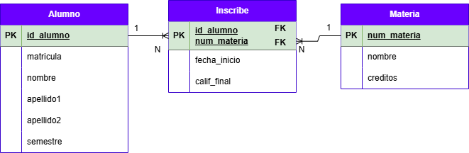
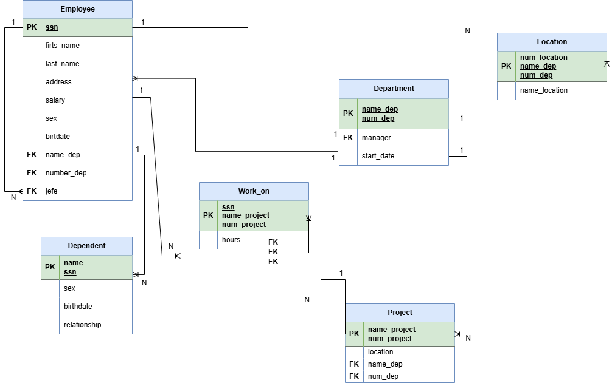
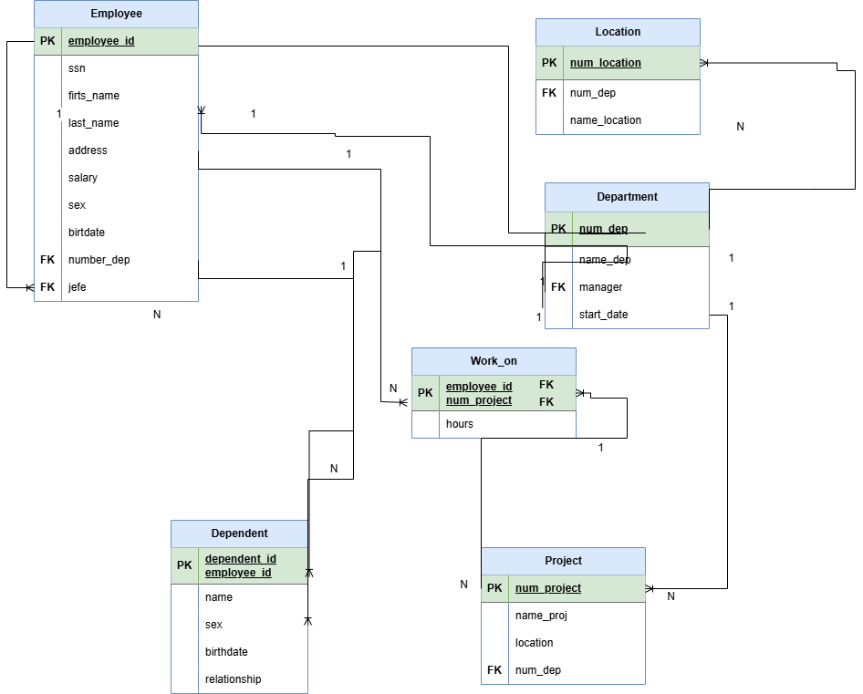
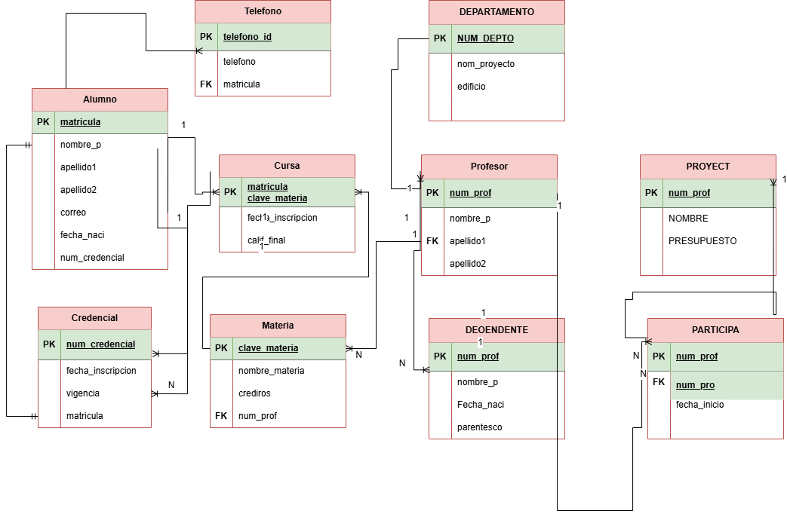

##  EJERCICIO DEL MODELO RELACIONAL

## Ejercicio 1

## Modelo E-R

## MODELO RELACIONAL

## EJERCICIO 2
### MODELO E-R

## MODELO RELACIONAL
[PROFESOR](..)
## EJERECICIO 3

## MODELO E-R

## MODELO RELACIONAL

## EJERCICIO 4

### MODELO E-R

## MODELO RELACIONAL

## EJERCICIO 5

## MODELO E-R

## MODELO RELACIONAL

## EJERCICO 6

## MODELO E-R

## MODELO RELACIONAL

## EJERCICO 7

## MODELO E-R

## MODELO RELACIONAL

