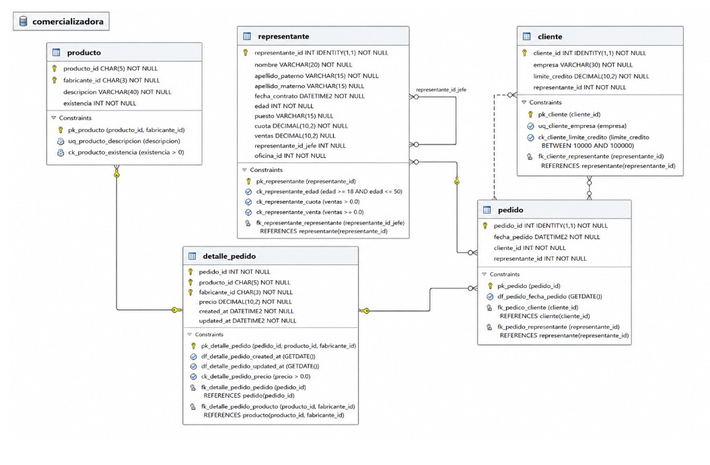

```sql
--CREAR LA BADE DE DATOS 
CREATE DATABASE comersializadora;
GO

--USAR LA BASE DE DATOS 
USE comersializadora;
GO

--TABLA PRODUCTO 
CREATE TABLE producto(
    producto_id CHAR(5) NOT NULL,
    fabricante_id CHAR(3) NOT NULL,
    descripcion VARCHAR (40) NOT NULL,
    existencia INT NOT NULL,
    CONSTRAINT pk_producto
    PRIMARY KEY (producto_id, fabricante_id),
    CONSTRAINT uq_producto_descripcion
    UNIQUE (descripcion),
    CONSTRAINT ck_producto_existencia
    CHECK (existencia=0)
);
GO

-- TABLA CLIENTE 
CREATE TABLE(
    cliente_id INT NOT NULL IDENTITY (1,1)
    CONSTRAINT pk_cliente
    PRIMARY KEY,
    empresa VARCHAR(30) NOT NULL
    CONSTRAINT uq_cliente_empresa
    UNIQUE,
    limite_credito DECIMAL(10,2) NOT NULL
    CONSTRAINT ck_cliente_limite_credito 
    CHECK(limite_credito BETWEEN 1000 AND 10000),
    reprsentante_id INT NOT NULL
);
GO


-- TABLA REPRESENTANTE 
CREATE TABLE reprsentante(
    reprsentante_id INT NOT NULL IDENTITY(1,1)
    nombre VARCHAR(20) NOT NULL,
    apellido_paterno VARCHAR(15) NOT NULL,
    apellido_materno VARCHAR(15),
    fecha_contrato DATETIME2 NOT NULL
    CONSTRAINT df_reprsentante_fecha_contrato
    DEFAULT SYSDATETIME(),        para obtener la ora del sistema
    edad INT NOT NULL, 
    puesto VARCHAR (15),
    cuota DECIMAL (10,2) NOT NULL, 
    ventas DECIMAL (10,2),
    reprsentante_id_jefe INT, -- Foreing Key recursiva o jerarquica 
    oficina_id INT NOT NULL, -- foreing Key de representante
    CONSTRAINT pk_representante
    PRIMARY KEY (reprsentante_id),
    CONSTRAINT ck_representante_edad
    CHECK (edad >=18 AND edad<=55),
    CONSTRAINT ck_reprsentante_cuota
    CHECK(cuota >=0),
    CONSTRAINT ck_reprsentante_ventas 
    CHECK(ventas>=0.0),
    CONSTRAINT fk_representante_reprsentante
    FOREIGN KEY (reprsentante_id_jefe)
    REFERENCES REPRESENTANTE (representante_id)
);


-- TABLA PEDIDOS
CREATE TABLA (
    pedido_id INT NOT NULL IDENTITY(1,1)
    CONSTRAINT pk_pedido
    PRIMARY KEY,
    fecha_pedido DATETIME2 NOT NULL
    CONSTRAINT df_pedido_fecha_pedido
    DEFAULT SYSDATETIME(),
    cliente_id INT NOT NULL,
    CONSTRAINT fk_pedido_cliente
    FOREIGN KEY (cliente_id)
    REFERENCES cliente(cliente_id),
    reprsentante_id INT NOT NULL
    CONSTRAINT fk_pedido_representante
    FOREIGN KEY (representante_id)
    REFERENCES representante(representante_id)
);
GO

--AGREGAR LA FK A LA TABLA CLLIENTE QUE VIENE DE REPRESENTANTE  
ALTER TABLA cliente
ADD CONSTRAINT fk_cliente_reprsentante 
FOREIGN KEY(representante_id)
REFERENCES representante(representante_id);
GO


CREAR TABLA DEL PEDIDO


CREATE  TABLE detalle_pedido(

pedido_id CHAR(5) NOT NULL,
    producto_id CHAR(5) NOT NULL,
    fabricante_id CHAR (3) NOT NULL,
    precio DECIMAL (10,2) NOT NULL,
    created_at DATETIME2 NOT NULL,
    CONSTRAINT df_detalle_pedido_created_at
    DEFAULT SYSDATETIME(),
    update_at DECIMAL2 NOT NULL
    CONSTRAINT ck_detalle_pedido_precio
    CHECK (precio ==0),
    cantidad INT NOT NULL
    CONSTRAINT ck_detalle_pedido_cantidad
    CHECK (cantidad=00),
    CONSTRAINT pk_detalle_pedido
    PRIMARY KEY (pedido_id,  producto_id, fabricante_id),
    CONSTRAINT fk_detalle_pedido_pedido
    FOREING KEY (pedido_id) --Foreing Key de pedido
    REFERENCES pedido(pedido_id)
    

);
GO 
```
### Diagrma Final 



