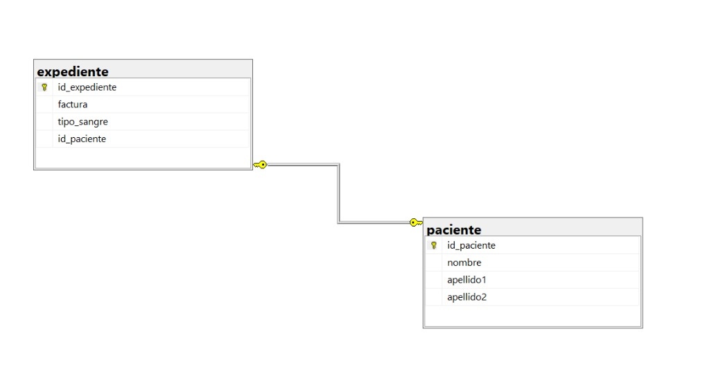

```sql
-- Crear la Base de Datos 

CREATE DATABASE hospital;
GO

-- Usar la Base de Datos
USE hospital;
GO

-- Tabla Paciente 
CREATE TABLE paciente(
id_paciente INT NOT NULL IDENTITY(1,1),
nombre VARCHAR(20) NOT NULL,
apellido1 VARCHAR(15) NOT NULL,
apellido2 VARCHAR(15),
CONSTRAINT pk_paciente PRIMARY KEY (id_paciente)
);
GO

-- Tabla Expediente 
CREATE TABLE expediente(
id_expediente INT NOT NULL IDENTITY (1,1),
factura DATETIME2 NOT NULL,
tipo_sangre INT NOT NULL, 
id_paciente INT NOT NULL,
CONSTRAINT pk_expediente PRIMARY KEY(id_expediente),
CONSTRAINT fk_expediente FOREIGN KEY (id_paciente)
REFERENCES paciente (id_paciente),
CONSTRAINT uq_expediente_paciente
UNIQUE (id_paciente)
);
GO
```
### DIAGRAMA FINAL

